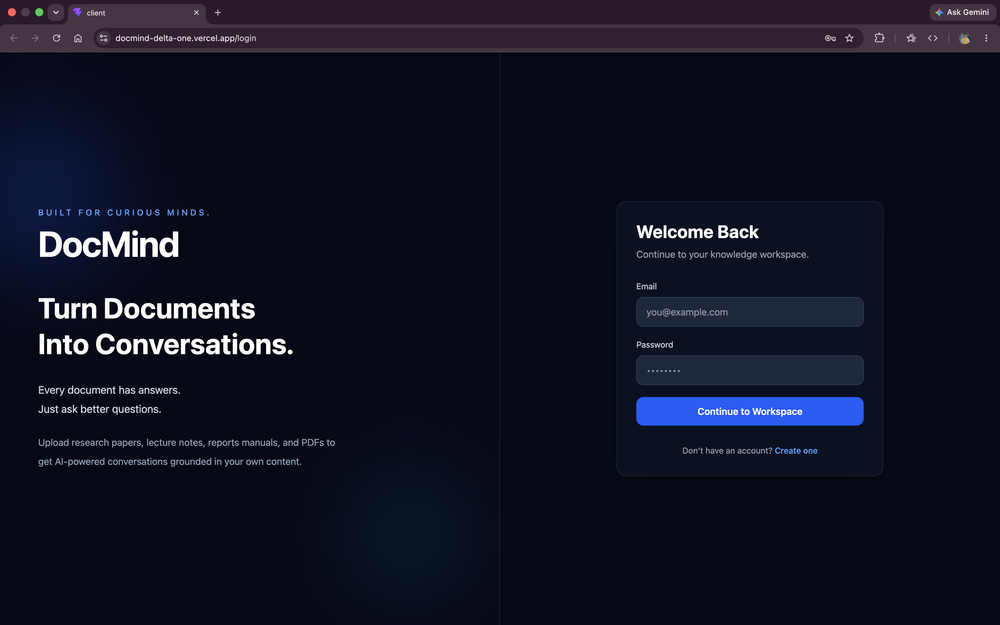
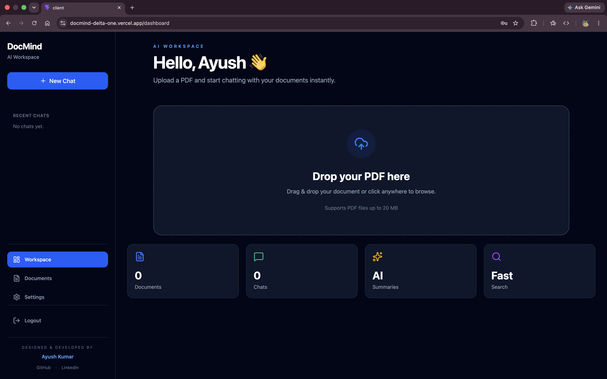
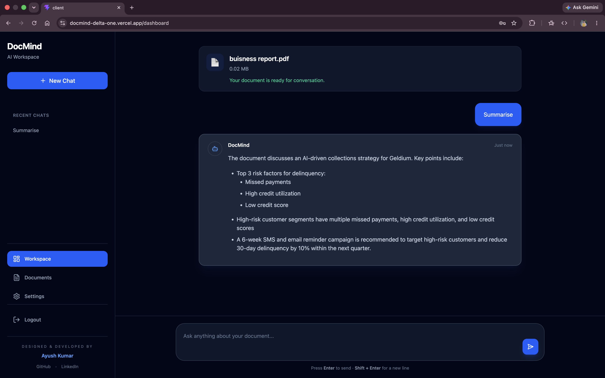

<div align="center">

# DocMind

### AI-Powered Document Intelligence Platform

Upload PDFs. Ask Questions. Get Context-Aware Answers.

<p>
Built with <strong>React</strong>, <strong>FastAPI</strong>, <strong>PostgreSQL</strong>, <strong>ChromaDB</strong>, <strong>Google Gemini Embeddings</strong>, and <strong>Groq Llama 3.3</strong>.
</p>

<br>

[](https://docmind-delta-one.vercel.app)
[](https://docmind-iyha.onrender.com)
[]
[]
[]
[]

</div>

---

# Live Demo

**https://docmind-delta-one.vercel.app**

---

# Overview

DocMind is an AI-powered document assistant that enables users to upload PDF documents and interact with them through natural language conversations.

Using a **Retrieval-Augmented Generation (RAG)** pipeline, DocMind retrieves the most relevant content from uploaded documents before generating responses, ensuring answers remain grounded in the document rather than relying solely on the language model's general knowledge.

The application combines modern web technologies with vector search and large language models to deliver an intuitive and production-ready document intelligence platform.

---

# Preview

## Landing Page

> `screenshots/landing.png`



---

## Dashboard

> `screenshots/dashboard.png`



---

## AI Chat Interface

> `screenshots/chat.png`



---

# Features

- Secure JWT Authentication
- User Registration & Login
- Upload PDF Documents
- Automatic PDF Text Extraction
- Intelligent Document Chunking
- Semantic Search using Vector Embeddings
- AI-Powered Question Answering
- Retrieval-Augmented Generation (RAG)
- Conversation History
- Responsive User Interface
- Production Deployment
- Rate Limiting & API Protection

---

# Tech Stack

## Frontend

- React
- TypeScript
- Vite
- Tailwind CSS
- Axios
- React Router

---

## Backend

- FastAPI
- Python
- SQLAlchemy
- PostgreSQL (Neon)
- JWT Authentication
- SlowAPI

---

## Artificial Intelligence

- Google Gemini Embedding API
- Groq API
- Llama 3.3 70B Versatile
- ChromaDB Vector Database
- Retrieval-Augmented Generation (RAG)

---

## Deployment

- Vercel
- Render
- GitHub

---

# Architecture

```
                    User
                      │
                      ▼
              React Frontend
                      │
               REST API Calls
                      │
                      ▼
              FastAPI Backend
                      │
      ┌───────────────┼────────────────┐
      │               │                │
      ▼               ▼                ▼
 PostgreSQL      ChromaDB      Gemini Embeddings
      │               ▲
      │               │
      └───────────────┘
                      │
                      ▼
            Groq (Llama 3.3 70B)
                      │
                      ▼
                AI Response
```

---

# How It Works

### 1. Upload Document

The user uploads a PDF document through the web interface.

↓

### 2. Text Processing

The backend extracts text from the uploaded PDF and divides it into overlapping chunks for efficient retrieval.

↓

### 3. Embedding Generation

Each chunk is converted into vector embeddings using the Google Gemini Embedding API.

↓

### 4. Vector Storage

The generated embeddings are stored in ChromaDB, enabling semantic similarity search.

↓

### 5. User Query

When a user asks a question, the query is converted into an embedding using the same embedding model.

↓

### 6. Context Retrieval

The most relevant document chunks are retrieved from ChromaDB based on semantic similarity.

↓

### 7. Response Generation

The retrieved context is sent to Groq's Llama 3.3 model, which generates a context-aware answer grounded in the uploaded document.

---

# Folder Structure

```
DocMind
│
├── client
│   ├── src
│   ├── public
│   ├── package.json
│   └── ...
│
├── server
│   ├── app
│   │
│   ├── api
│   ├── core
│   ├── models
│   ├── rag
│   ├── services
│   ├── uploads
│   ├── processed
│   └── chroma_db
│
└── README.md
```

---

# Installation

## Clone Repository

```bash
git clone https://github.com/Ayushkumar20045/DocMind.git

cd DocMind
```

---

## Backend Setup

```bash
cd server

python -m venv .venv

source .venv/bin/activate

pip install -r requirements.txt

uvicorn main:app --reload
```

---

## Frontend Setup

```bash
cd client

npm install

npm run dev
```

---

# Environment Variables

## Backend

```env
DATABASE_URL=

SECRET_KEY=

ACCESS_TOKEN_EXPIRE_MINUTES=

GOOGLE_API_KEY=

GROQ_API_KEY=

MODEL_NAME=llama-3.3-70b-versatile
```

---

## Frontend

```env
VITE_API_BASE_URL=https://your-backend-url
```

---

# Author

## Ayush Kumar

Computer Science Engineering (Data Science)

**GitHub**

https://github.com/Ayushkumar20045

---

# License

This project is licensed under the MIT License.

---

<div align="center">

### If you found this project helpful, consider giving it a ⭐ on GitHub!

Built with ❤️ by Ayush Kumar

</div>